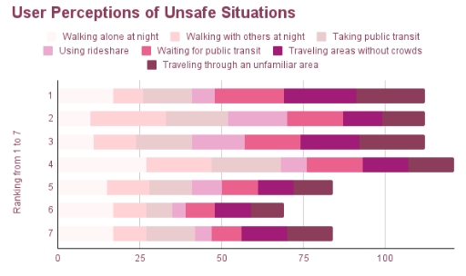
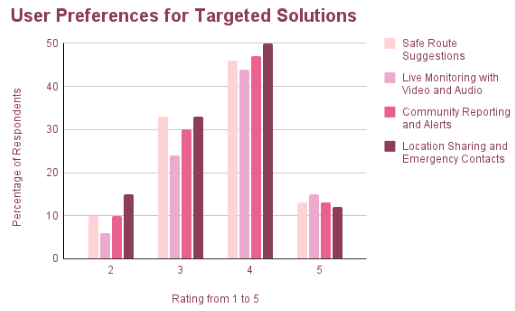

# Final Post

## Introduction

As women and/or people of color, every member of our team has felt uncomfortable at some point when traveling. The fear of being alone, traveling at night, being confronted or attacked, etc. is ever present and influences when, who, why, where, and how we travel. Based on our personal experiences in our close circles, we recognized that we were not alone in this fear. However, we recognized that there aren’t any highly mainstream applications focused on safety when traveling, and certainly not targeted specific to marginalized communities. Thus, we centered our project on safe transportation, specifically towards women and people of color.

## User Research

First, we conducted user research to understand the strengths of pre-existing technologies, struggles of our users, and gaps in technologies in this field that we could potentially resolve. We hoped to receive and analyze qualitative, anecdotal data from our users as well as narrow potential system approaches to bridging these technology gaps. Our user research spanned three weeks and covered three different types of research: observational study, survey, and semi-structured interviews.

### Observational Study

The goal of our observational study was to understand how women and people of color currently navigate public transportation and how they react to potential threats to their safety. At around 7PM, one member of our team took the 6 line from Luskin Conference Center at UCLA to a bus stop in Culver City, walked 0.2 miles to the next bus stop, and then took the 7 line to a shopping complex on Venice Boulevard.

While waiting for the bus, I noticed a group of girls standing a bit farther away from the bus stop. They didn’t seem like they frequently used public transportation because they were talking loudly to each other trying to figure out where to go and what bus to take next. While a group of boys next to them talked confidently and strode into the bus once it arrived, the girls held back and waited for approval from the driver. The girls then sat in the very back of the bus, continuing their personal conversations, but every time the bus stopped, they would look up to see who entered and exited the bus. They continued to talk about how many stops there are until they get down and how to get to the bus stop where their next bus will leave from.

After I got down from the 6 line, I walked over to the 7 line bus stop. I noticed that it was very dark and the sidewalk was quite cracked, which made me feel unsafe. There was some light near the bus stop I was going to, but not the one I got off from. At the 7 line bus stop, there were two girls watching TikToks while also checking when the bus will come and constantly looking up at the general road area. When the bus arrived, the two girls stuck their heads in briefly before walking a couple steps away. They debated for a few seconds whether or not to get on the bus or wait for the next one because they thought there were suspicious people on the bus, but they ultimately decided to just get on the bus. Once they were on the bus, they mainly just stuck to their phones and avoided contact with other people. 

### Survey

The goal of our survey was to reach more people for general perceptions regarding what makes them feel unsafe and what potential solutions they might deem useful via ranking (qualitative + quantitative) data. We surveyed 25 women, of which almost all were women of color, between the ages of 18 and 24.

In addition to demographic information, we asked them three critical questions. 

1) to rank how unsafe the following situations feel to them: walking alone at night, walking with others at night, taking public transportation, using rideshare, waiting for public transportation, traveling areas without crowds, and traveling through an unfamiliar area. The results for this question are shown below, where 1 signifies safest and 7 signifies the least safe.

2) to rank the importance of the following characteristics in making a route safer: bright lighting/time of day, sanitary conditions, crowd presence, and police presence.

3) to rate how likely they are to use the following potential solutions on a scale from 1 (not at all) to 5 (a need): safe route suggestions, live monitoring, community alerts, and location sharing + emergency contacts. The results for this question are shown below.

### Semi-Structured Interviews

The goal of our interviews was Our team interviewed 32 users, primarily women and people of color in their late teens and early twenties, over four different rounds. These interviews were semi-structured because we sought a balance between letting the user drive the interview with their unique anecdotes on safety with transportation and our defined questions to get deeper at why and how people feel unsafe.

We asked users the following questions.

*What modes of transportation do you use either in your daily life or on special occasions, and how often do you use each of these modes?*
*What would need to change for you to change your mode of transportation?*
*If they do not take public transportation: What would have to change for you to take public transportation regularly? Is there anything that would convince you to do so?*
*How often do you travel alone? With other people? Does how you prepare or feel safe change based on who you’re traveling with?*
*Have you ever felt unsafe when traveling? What was that experience like, and why did you feel unsafe?*
*In general, what kinds of situations make you feel unsafe when traveling? What do you do in real-time to feel more safe in these situations?*
*Have you ever changed your route or strayed away from a routing app because of safety concerns?*
*How likely are you to use the following potential features if they were in your app? Would it make a big difference if they were in your current maps app versus another app?
Safe route suggestions based on lighting, criminal activity, etc.?
Live monitoring system (video + audio)?
Community reporting and alerts?
Location sharing and emergency contacts?
Imagine you were walking alone at night, taking the same route you usually do, but you start to feel unsafe. There are people in the area who look suspicious to you. What would you do?
Do you think your gender, race, etc. influence this reaction? Would your reaction change if your identity was something else?*

### Summary

Based on the three different kinds of user research above, we derived three key findings.

Users seek not only speed, but also safety travel criteria when traveling, which is currently not supported by technology

In our semi-structured interviews, we uncovered from user anecdotes that there are a wide variety of aspects that make users feel unsafe: lighting, crime, cleanliness, foot traffic, sidewalk breaks, suspicious people, etc. We asked interviewees what they prioritize most: safety, speed, or cost. Almost all users said safety is the most important factor when traveling. However, none of the users, across the survey and interviews, reported ever using a safe transportation app, but instead, traditional navigation apps that focus on efficiency and speed. Thus, there’s a clear gap between user needs and the technology that actually exists and is frequently used: our project can aim to bridge this gap.

*1) Different users find different travel criteria unsafe to different extents*

Although almost all users rated safety as the most important factor, that doesn’t explain the sub-criterias of safety. Our interviews with users highlighted different unique anecdotes. Some users were afraid of traveling alone at night, some were afraid of being in an uncrowded place, some were afraid of being attacked and not being able to defend themselves, some were afraid of waiting at bus stops, etc. We tried grouping these many anecdotes into seven general situations for our survey to gauge more user perceptions.

Looking at the User Perceptions of Unsafe Situations plot from our survey, we can see that every of the seven “unsafe” situations are ranked every position from 1 through 7 by at least one of our 25 respondents. Specifically, there seems to be a near equal spread for each situation across the seven potential ratings.  Thus, it would be unfair of us to simply rank how safe routes are without taking into account how the specific user even defines safety.

*2) Gender and race influence user reactions to potential threats to safety*

Almost every interviewee agreed that not being a man or being a person of color makes them feel more unsafe in the same situations as those who are not marginalized. Many users reported that if they were a man or White, they would not bat an eye at situations like traveling at night or in uncrowded places because they wouldn’t feel threatened by a potential attack. This furthers the need for a project that not only focuses on safe transportation, but specifically for women and people of color because these are the populations who feel higher levels of unsafety when traveling.

Based on this user research, we designed our problem statement and our design goals to match what our users would find useful to alleviate their transportation concern.

## Problem Statement

Travelers, especially women and people of color, are concerned about their safety when traveling, including lighting, crime, cleanliness, etc. Unfortunately, most navigation apps prioritize efficiency and speed for practicality when routing rather than these human-sensitive safety features. Users should be able to compare alternate routes based on their personal opinions regarding lighting, crime, cleanliness, speed, cost, etc. to find the best route for them.

## Design Goals

Users should be able to compare their potential routes when navigating depending on their personal preferences regarding travel criteria like lighting, crime, cleanliness, speed, etc.
Users should be able to access more detailed information regarding these travel criteria rather than just numerical scores so they can make more well-informed decisions.
Users should be able to read and write real-time community alerts they notice when traveling

## Further Analysis

Given our in-depth user research, we defined personas and a process map to better understand the gap in technology and guide our system approach.

### Personas

Our user research mainly developed two critical personas, even within our narrowed audience of young women and people of color: those who frequently use public transportation and those who don’t. Users who frequently use public transportation seemed to not be as afraid of the different travel criteria as users who do not frequently use public transportation. Users who do not frequently use public transportation seemed concerned about the safety of public transportation and about traveling alone in particular. All users, however, had similar reactions to potential threats: location sharing, calling someone, avoiding confrontation, etc.

Thus, we derive two personas.
1) Bianca, a 19 year old UCLA residential student who typically uses rideshare when exploring LA, but occasional uses public transit with her friends
2) Maithili, a 21 year old UCLA student in the apartments who frequently uses public transportation to get to work and travel around LA alone and with friends

However, even within personas, there is still much variability in the user preferences for travel criteria, as per finding #1 of the user research.

### Process Map

Currently, when users want to travel somewhere new, they open up multiple apps on their phone, such as, but not limited to: rideshare, public transit, typical navigation app, etc. Users examine different details about their different options, like how much the rideshare costs or how long the bus will take, before somehow deciding which mode of transportation to use. This decision making is a gray area because there is no set methodology or way to translate the user’s thoughts going into this route selection. Our project thus aims to translate user preferences into actionable, data-driven decisions through ranked routes.

## System Design and Implementation

We designed our mobile app Atria to be an all-in-one vehicular safe transportation app. It ranks all possible routes based on each user’s personal safety preferences, including lighting, foot traffic, crime history, and cleanliness. Instead of choosing routes solely by speed, Atria empowers users to customize what matters most to them and receive tailored, safety-forward navigation.

### Data and Tech Stack

Our app features a React.js/Expo (web + native) frontend and a Node.js/Express.js backend, which we selected for mobile and web use. Atria lets you customize your user preferences and search for a start and end location for navigation in the UI. Routes will be generated and then scored by external datasets for safety. Routes will then be sorted based on user preferences towards these safety travel criteria, and users can further delve into certain routes for more information.

We used MongoDB as our database because it’s flexible to handle our two different components: datasets and userprofiles. Four publically available datasets from the LA city on foot traffic, cleanliness, crime, and lighting are stored in the datasets portion. Each user profile, which holds their preferences for each travel criteria, is also stored in the database.

When a user wants to navigate, they start typing the start and end locations. Suggested locations based on what is already typed show up underneath through calls to Mapbox’s Geocode API. After the user successfully selects a start and end location, multiple steps occur:

1) Up to 2 driving routes are generated via Mapbox Routes API
2) A rideshare route is generated with the same route as the fastest driving route, and its price is estimated.
3) Up to 2 bus routes are generated via Transitland Routes API
4) For each route, foot traffic, lighting, crime, and cleanliness are all scored from 0-1 either by using direct values from the dataset (foot traffic and cleanliness) or calculating a per quarter mile metric (lighting and crime).
5) The scores in part 4, as well as normalized speed and cost from 0-1, are weighted by user preferences to get the user-personalized score for that route

This information is passed over to the frontend so it can be displayed and so the route cards are organized by user-personalized score.

The APIs have high free tiers, making them optimal for our system. The datasets are quite large, which causes low latency and some storage issues with MongoDB, so caching could be implemented in the future.

Users can also search through community alerts (that are stored in the MongoDB database and appear on the UI) and add their own alerts to the database. 

## Evaluation

Our evaluation was focused around our two key motivating questions. Our first question focuses on the usability of our system while the second question focuses on the user impact in order to gauge how our system performs as a whole.

Are users able to translate their personal preferences regarding travel criteria into personalized ranked navigation routes via Atria’s user profile design?

Do these personalized ranked navigation routes better help users explore their potential transportation options and ultimately decide how to travel to their destination?

Our method for this evaluation was to do six evaluation studies with new users with three tasks each.

Adjust your personal travel preferences to generate personalized routes for whichever start and end location in LA the user chooses
Compare the different potential route cards and select which route best aligns with them
Read and provide information to the community about any dangers or threats you experienced while traveling

We performed these 20-minute studies in a think-aloud manner where we consistently asked users what they were thinking as they navigated through the app and asked for feedback at the end. We captured both system log data on how well they completed each task as well as qualitative survey data on how well the user felt interacting with our system.

For our analysis approach, we created the metrics + data table below. We aimed for a balance between quantitative measures of how well the user performed at the given task (through the system log) and how they felt performing the given task (through the survey).

Question 1
System Log
% of users who successfully adjust travel preferences and receive personalized routes
Time taken to adjust preferences
Sequence of actions (preferences to navigate)
Survey
[Complexity]: "I found the system unnecessarily complex." 
[Quick to Learn]: "I would imagine that most people would learn to use this system very quickly."
[Confidence in Use]: "I feel very confident using this system."

Question 2
System Log
Number of different routes viewed and considered
Time taken to learn information about each route
Time taken to select a route
Survey
[Data]: “The safety information given was novel and sufficient enough to select a route.”
[Data]: “I feel well-informed about all my potential route options”
“The personalized rankings helped me select a route.”

## Findings

*Are users able to translate their personal preferences regarding travel criteria into personalized ranked navigation routes via Atria’s user profile design?*

Yes, although with some confusion. Every user was eventually able to successfully adjust travel preferences and receive personalized routes, but the time it took for users to accomplish this varied widely. Three users followed the sequence of actions by thoroughly looking through user settings first before navigating away. Because of this, they read through the preferences section and understood the goal of the sliders and rankings. Two users did not follow this sequence of actions. Instead, they clicked the ‘Add a Route’ button that appears on the user settings page that navigates to the routing page. Because of that, some users reached the routing page before they personalized their preferences which 1) left them confused when they saw the default rankings for each route because they didn’t know where the numbers came from and 2) left them confused when the next task was to adjust the preferences because they didn’t know where to find it. For that reason, those two users and another two users (who struggled to find the settings page from the route page) said that this system was somewhat complex. Many said that once you fully explore the system it makes complete sense and makes them feel more confident, but starting off, for the first few minutes, it was difficult to pick up which information was stored where. 

*Do these personalized ranked navigation routes better help users explore their potential transportation options and ultimately decide how to travel to their destination?*

Somewhat. Two users just trusted whatever route was ranked #1 to be the route that they should take without really examining each travel criteria’s score and the detailed maps. These users only viewed 1 or 2 routes and didn’t take more than 2 minutes to finally select their route. The personalized rankings were critical for their selection because they just went based off of the final score, leaving them well-informed and satisfied. Four users, however, were very engaged in dissecting the routes, and two even wished there was more information. They thought details would show more information about bus routes, overlaid maps, direct dataset information, etc. They searched through the detailed maps and checked each travel criteria’s subscore for 2-3 routes, and thus took at least 5 minutes to select a route. These users agreed that the safety information was useful and informed them, but they hoped for even more information.

Based on our evaluation studies, we conclude that our system is a little complex, particularly with the travel preferences and navigation, but the personalized rankings feature really helps users select a route best for them. 

## Discussion

Our main limitations, as explained above, are the low latency, limited datasets, and unfinished Maps integration. We didn’t expect the datasets to be so large, so we did not implement any cloud or caching method for the datasets, causing a 1-2 minute wait for the routes to be scored and loaded. We also only feature four static datasets for the different travel criteria, while some users wanted more information (particularly more real-time data) to base their route decisions on. Finally, the end goal of this system was for users to be able to click ‘Go’ and actually be routed with a live location by launching Apple Maps. We weren’t able to finish this functionality yet, so users are able to see some information about their route but not actually follow it with street granularity just yet (including bus stops).

Our future work includes resolving the limitations above, but based on our evaluation, we do have further new questions regarding our system that could guide future work.
 
*Is a weighted sum really the best model for the user-personalized score?*

Some users accepted the user-personalized score at face value while others wanted more information on how the score was calculated. Different regression models besides a simple weighted sum could be explored to best align with users. 

*How can we help users who struggle to translate their personal preferences into 1-20 ratings or rankings?*

We could conduct more user research and develop user profiles with specific values for the travel preferences based on our findings. Then, upon each account creation, the user could fill out a survey with what-if scenarios and their personal opinions on which situations feel more unsafe to sort them into one of these user profiles for default preferences that somewhat match their opinions.

*How can we integrate community alerts into our safety rankings, and would users find this feature useful?*

Currently, the community alerts page is for personal use and not integrated into the rankings due to unreliability and bias concerns. However, users expressed wanting more real-time data for route rankings, so we could explore methods for ensuring the validity of the community alerts (such as through NLP techniques) and then integrating them into the ranking if that user prefers including community information.

Various mistakes throughout the design and development process lead us to learn key lessons.

*1) There should be a balance between user personalization and system structure*

We gave users the freedom to personalize preferences, but this caused confusion for users to score their opinions themselves from ratings 1-20 and rankings. We gave them a lot of flexibility at the risk of users: having some default values or trial personas that users can click through to get a sense of how they should do their rankings would give them more structure rather than making them figure it out.

We also limited users. When we began developing, we figured that only one persona was necessary. However, during further interviews and usability tests, we realized that there were many diverging characteristics we didn’t account for. Primarily, we developed our system with well-seasoned users in mind, not first-time users (see point 3). Different users are open to different kinds of transportation (for example, many users were strongly against public transportation for lack of further knowledge on it), but our system does not allow for users to choose their modes of transportation or to quickly pick up the system.

*2) Deep dive into dependencies (APIs, datasets) before implementation*

We collected our APIs and datasets prior to implementation but did not fully explore them. As a result, we didn’t recognize that Mapbox does not provide bus routes, Uber and Lyft APIs require weeks to be approved, and our datasets are extremely large. We instead had to scramble for alternatives (Transitland, estimating rideshare cost, and accepting low latency), which directly led to limitations of our system. More thorough exploration of dependencies would have saved us this time and effort.

*3) Systems may be simple, but hard to learn without proper documentation/instructions*

Although our system does not feature many pages, users had difficulty understanding the sequence of pages, particularly going back and forth between travel preferences and routing because they didn’t know travel preferences was in the settings page or that it should be accessed to change the route scores. Incorporating a tutorial page or having subtitles on different pages explaining what the page is about and where to go would help users better pick up how the system works. After that, it’s easy for the users to actually use the system. In general, having more full sentences in the app explaining what the different subscores mean could also be helpful.

	

